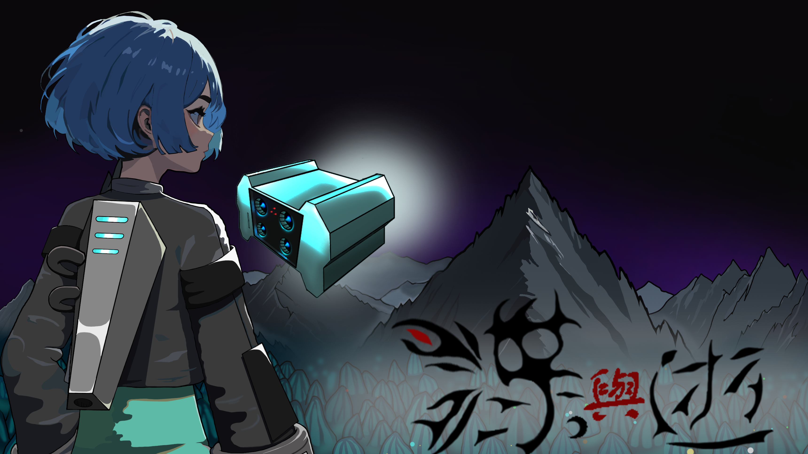
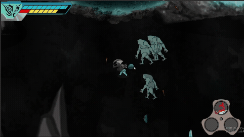

# 🦋 蝶與逝

《蝶與逝》是一款 2D 俯視角冒險遊戲，背景設定在虛構星球「拉瑪」，玩家需在環境危機與能源短缺的夾縫中生存與探索。本遊戲結合科幻與永續議題，鼓勵玩家透過選擇與互動，思考人與自然的平衡關係。

遊戲特色包括：
- 🌀 生態互動與資源策略：每個行動都會影響星球生態
- 🧠 道德抉擇與多重結局：選擇影響遊戲進展與結局
- 🤖 機器人夥伴與劇情探索：揭開主角父母失踪之謎
- 🦋 蝴蝶能量系統：創新的技能解謎與生存方式

---

## 🧠 Boss 行為展示

---

## 📽️ 遊戲展示影片

    

---

## 👨‍💻 製作團隊

| 負責項目     | 成員   |
|--------------|--------|
| 遊戲程式     | 林其鈺 |
| 遊戲美術     | 黃韋樺 |
| CG 美術製作  | 余宗澤 |
